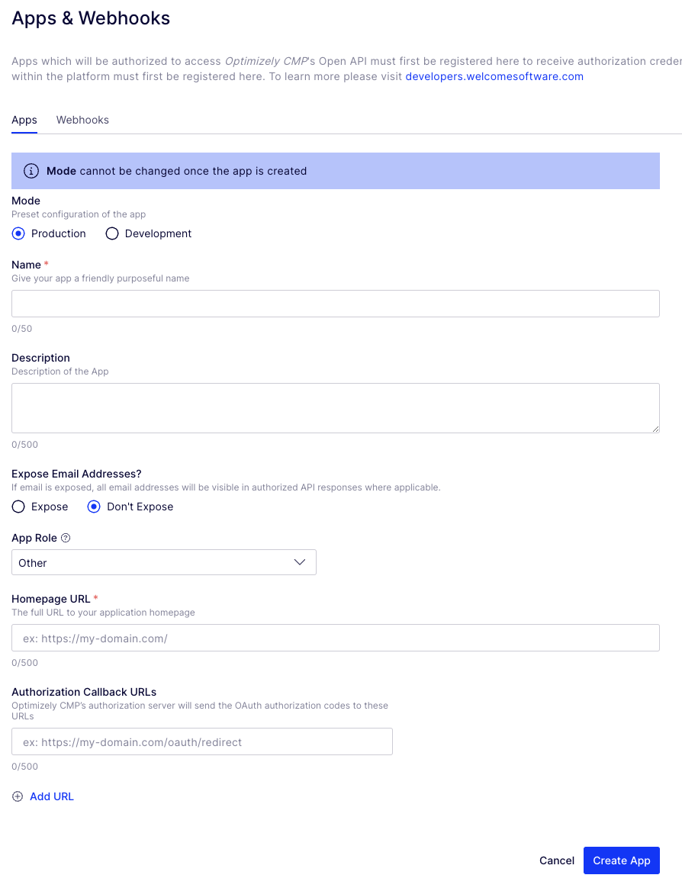
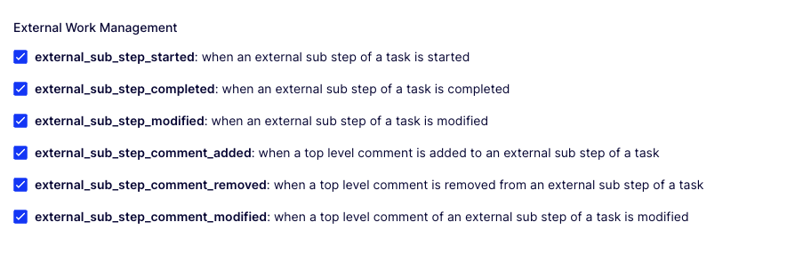
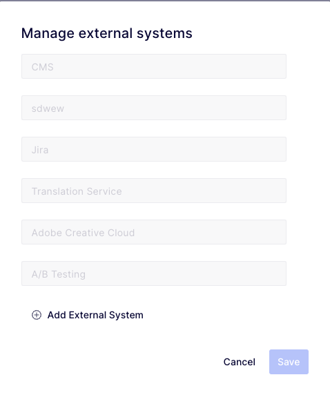

# CMP - CMS Workflow Integration

This integration allows you to create an external workflow task in Optimizely CMP, where the task is managed in Optimizely CMS and the CMS editor can complete the task without having access to CMP.

The idea for this integration is to create something similar that we have example for Jira and Adobe CC, where you have an external workflow step that is completely managed outside CMP.
The integration is not tied to working on a specific page or block in the CMS that is selected from CMP. The task can include any kind of updates of one or more content items on the web site. The editor in CMS doesn't need to login to CMP to read the instructions or to mark the task as done, this is completely managed in CMS.

# Configuration

## CMP

### Create an App



Once you have created an App, you should get a ClientId and a ClientSecret. These will be required for the CMS configuration.

### Register a Webhook



Make sure that you only check the "External Workflow Management" notifications and uncheck.

### Create a Workflow with External Step



When you create a workflow with an External Step, click on "Manage External Systems" and give your CMS system a unique name. This external system id will be needed when configuring the plugin on the CMS side.

## CMS

Install the nuget package. The nuget can be found here:

### AppSettings.json

```json
"EPiServer": {
  "Cms": {
    "CmpCmsWorkflow": {
      "ClientId": "client-id",
      "ClientSecret": "client-secret",
      "ExternalSystemId": "external-system-id"
    }
  }
}
```

### Startup.cs

```csharp
services.AddCmpCmsWorkflows();
```

## Gotchas

Your CMS instance needs to have a public facing url for the CMP to be able to send Webhook Notifications
