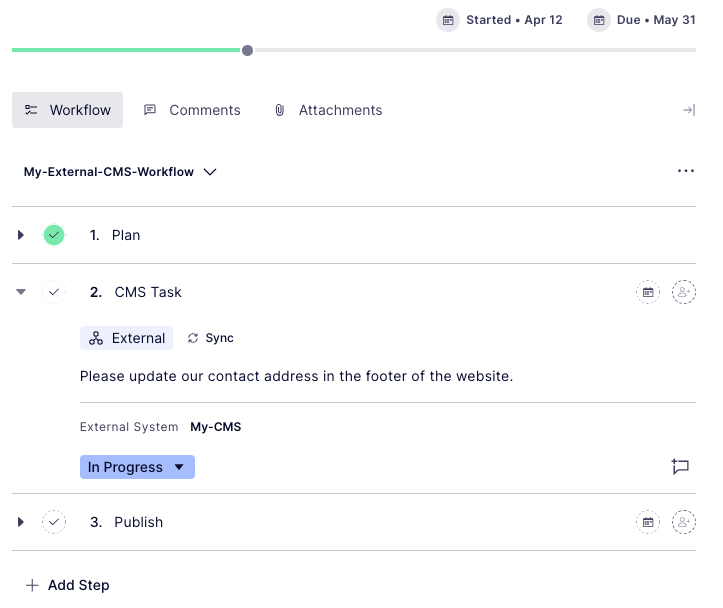

# CMP - CMS Workflow Integration

This integration allows you to create an external workflow task in Optimizely CMP, where the task is managed in Optimizely CMS and the CMS editor can complete the task without having access to CMP.

The idea for this integration is to create something similar that we have example for Jira and Adobe CC, where you have an external workflow step that is completely managed outside CMP.
The integration is not tied to working on a specific page or block in the CMS that is selected from CMP. The task can include any kind of updates of one or more content items on the web site. The editor in CMS doesn't need to login to CMP to read the instructions or to mark the task as done, this is completely managed in CMS.

## Features

- The editor in CMP can create a task that will be be managed in CMS
- When an external workflow step is triggered it is reflected under "Tasks" in the CMS
- The CMS user can update the status of the task in the CMP
- With this integration one CMP instance can connect to multiple instances of CMS

## Configuration

## 1. CMP

- You need administration permissions to configure the integration in CMP.

### 1.1 Create an App

Give your app a **name** ("My-CMS") and input the **public url** of your website. The callback url can be left empty or set to the same url.


Once you have created an App, you should get a **ClientId** and a **ClientSecret**. These will be required for the CMS configuration.

### 1.2 Register a Webhook

Create a new Webhook and give it a name ("My-CMS-Webhook"). As the Callback url enter the url to to your site and append the webhook:
**/api/cmp-cms-workflows/webhooks**

```https://my-site.com/api/cmp-cms-workflows/webhooks```

**Note:** Your CMS instance needs to have a public facing url for the CMP to be able to send Webhook notifications.

For **Secret**, use the value you generated when creating the App.


Select the below events. Make sure that you only check the **"External Work Management"** events.


### 1.3 Create a Workflow with External Step

Create a new workflow. One of the steps should be an **external step**. In this example we create a workflow with three steps: "Plan", "CMS Task", "Publish".
The "CMS Task" step is created as an external step.


For the configuration of the **External Step**, click the **"Manage External System"** button and **give your CMS system a unique name** ("My-CMS)". This external system name will be needed when configuring the plugin on the CMS side.


Then select your external system in the **"Select external system" dropdown list**.

## 2. CMS

Install the nuget package. The nuget can be found here:

[https://nuget.optimizely.com/package/?id=Research.CMP.CMS.Workflows](https://nuget.optimizely.com/package/?id=Research.CMP.CMS.Workflows)

### 2.1 AppSettings.json

**ClientId** and **ClientSecret** corresponds to the values created in the App in CMP. **ExternalSystemID** is the name you created for your external system (i e "My-CMS" in the example in the screenshot).

```json
"EPiServer": {

  "Cms": {
    "CmpCmsWorkflow": {
      "ClientId": "client-id",
      "ClientSecret": "client-secret",
      "ExternalSystemId": "external-system-id",
      "WebhookSecret": "secret-from-cmp-webhook"
    }
  }
}
```

### 2.2 Startup.cs

In usings add:

```csharp
using Research.CMP.CMS.Workflows;
```

In ConfigureServices(...) add:

```csharp
services.AddCmpCmsWorkflows();
```

## 3. Example

### 3.1 Create task in CMP

Create a new task in CMP and select your new workflow.



Write the instructions of the task you want the CMS editor to perform as the **description** of the external step. In this case, the task is to update the company address in the footer of the website. Hit the **Sync button**.

### 3.2 Perform the task in CMS

The editor in CMS will now see the new task in the task pane.


**Click the task** to read the instructions. Perform the task, then come back to the task instructions, and **update the status from "InProgress" to "Completed" and then click the Publish button**.

The step in **CMP** will now be marked as **Completed**.

---

**Good luck :)**
